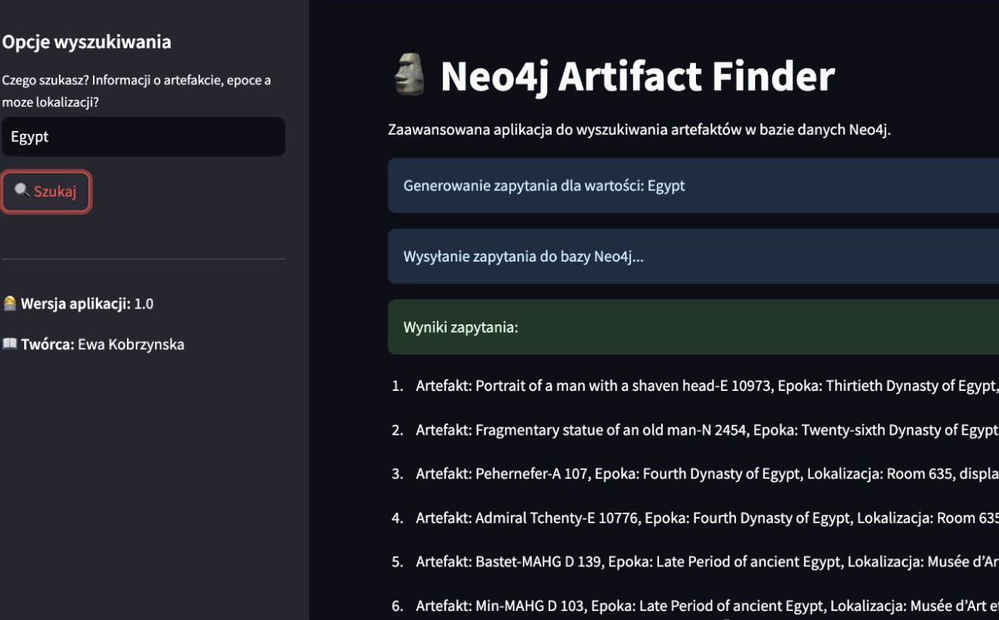

# 🗿 Neo4j Artifact Finder  

<table>
  <tr>
    <td width="40%">
      <p align="center">
        
      </p>
    </td>
    <td width="60%">
      Neo4j Artifact Finder is an advanced application for searching historical artifacts, eras, and locations using the Neo4j database. It leverages the FLAN-T5 language model and Cypher queries to enable intelligent information retrieval.
    </td>
  </tr>
</table>

## 📚 Table of Contents  

- [📖 Project Overview](#-project-overview)  
- [✨ Key Features](#-key-features)  
- [⚙️ Installation](#️-installation)  
- [🚀 Running the Application](#-running-the-application)  
- [🧠 How It Works](#-how-it-works)  
- [📌 Usage Examples](#-usage-examples)  
- [📜 License](#-license)  

---

## 📖 Project Overview  

**Neo4j Artifact Finder** allows users to search for historical artifacts based on incomplete names of artifacts, eras, or locations. By utilizing the **FLAN-T5** language model and the **Neo4j** database, the application can:  

✅ Match partial names and suggest the correct results.  
✅ Link artifacts to their corresponding eras and locations.  
✅ Generate dynamic **Cypher** queries for Neo4j.  

This tool is useful for historians, researchers, and enthusiasts who need a structured and intelligent way to explore historical data.  

---

## ✨ Key Features  

- **🔍 Intelligent Search:** Supports partial name searches for artifacts, eras, and locations.  
- **📊 Neo4j Integration:** Uses graph database queries to retrieve accurate historical connections.  
- **🧠 AI-Powered Processing:** FLAN-T5 analyzes user queries and refines search parameters.  
- **⚡ Fast & Efficient:** Optimized Cypher queries ensure quick database responses.  
- **💻 User-Friendly Interface:** Built with **Streamlit** for an interactive search experience.  

---

## ⚙️ Installation  

To set up the project, follow these steps:  

1️⃣ **Clone the repository:**  

```bash
git clone https://github.com/ewakobrzynska/GraphRAG.git
cd GraphRAG
```

2️⃣ **Create a virtual environment (optional but recommended):**  

```bash
python -m venv venv
source venv/bin/activate  # On Windows use: venv\Scripts\activate
```

3️⃣ **Install dependencies:**  

```bash
pip install -r requirements.txt
```

---

## 🚀 Running the Application  

Once installed, launch the application using:  

```bash
streamlit run app.py
```

This will start a local web server where you can interact with the search tool.  

---

## 🧠 How It Works  

1. **User Input:** The user enters a partial name of an artifact, era, or location.  
2. **AI Query Processing:** The **FLAN-T5** model refines and understands the search intent.  
3. **Cypher Query Generation:** A Cypher query is dynamically constructed to retrieve relevant data from the **Neo4j** database.  
4. **Result Display:** The application presents artifacts, their associated historical eras, and locations in an easy-to-read format.  

---

## 📌 Usage Examples  

| User Input  | Suggested Results |
|-------------|------------------|
| `Egypt`     | *Late Period of Ancient Egypt, Pyramid of Giza, Valley of the Kings* |
| `Roman`     | *Roman Empire, Colosseum, Roman Coins* |
| `Athens`    | *Classical Greece, Parthenon, Athenian Pottery* |

---

## 📜 License  

This project is open-source and licensed under the **MIT License**.  

🔹 **Author:** [Ewa Kobrzynska](https://github.com/ewakobrzynska)  
🔹 **Version:** 1.0  

Feel free to contribute to the project or report any issues! 🚀
